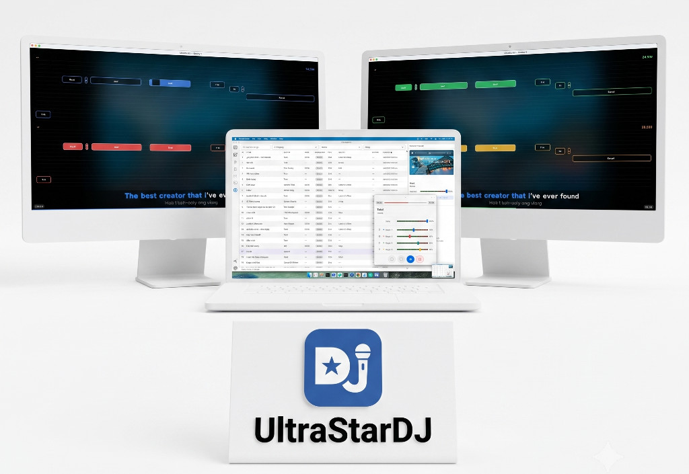

# UltrastarDJ

> A desktop karaoke DJ app — manage your song library, assign microphones, run a singer display, and score live performances.

<!-- Hero mockup — replace with actual screenshot -->
<p align="center">
  
</p>

---

## Workflow

<table>
  <tr>
    <td align="center">
      <strong>1. Select song sources</strong><br><br>
      <a href="docs/screenshots/01-load%20song%20sources.png">
        
      </a>
    </td>
    <td align="center">
      <strong>2. Assign microphones to players</strong><br><br>
      <a href="docs/screenshots/02-assigne%20microphones%20to%20players.png">
        
      </a>
    </td>
  </tr>
  <tr>
    <td align="center">
      <strong>3. Select preview player audio output</strong><br><br>
      <a href="docs/screenshots/03-select%20preview%20audio%20output.png">
        
      </a>
    </td>
    <td align="center">
      <strong>4. Assign players to displays</strong><br><br>
      <a href="docs/screenshots/04-assigne%20players%20to%20screens.png">
        
      </a>
    </td>
  </tr>
  <tr>
    <td align="center">
      <strong>5. Load song into player</strong><br><br>
      <a href="docs/screenshots/05-load%20song%20into%20player.png">
        
      </a>
    </td>
    <td align="center">
      <strong>6. Play — 1 or 2 displays</strong><br><br>
      <a href="docs/screenshots/06-play%20game.png">
        
      </a>
    </td>
  </tr>
</table>

---

## Platform support

| Platform | Status |
|---|---|
| macOS (Apple Silicon) | ✅ Tested |
| macOS (Intel) | 🔲 Not tested |
| Windows | 🔲 Build environment not yet tested |
| Linux | 🔲 Not tested |

## Known limitations

- **YouTube-only songs**: preview audio always plays through the system default output. Routing to a second audio output (e.g. audio interface) is not supported for YouTube previews — only songs with a local audio or video file support custom output routing.

---

## Tech stack

| Layer | Technology |
|---|---|
| Desktop shell | [Tauri 2](https://tauri.app) (Rust) |
| Frontend | [Svelte 5](https://svelte.dev) + TypeScript |
| Routing | SvelteKit with `adapter-static` |
| UI components | [@material/web](https://github.com/material-components/material-web) |
| Song format | [UltraStar](https://ultrastar.eu) `.txt` |

## Architecture

Two windows, one codebase:

- **DJ window** (`/`) — library, queue, player controls, mic mixer
- **Beamer window** (`/beamer`) — singer display with synced lyrics and scoring

All IPC between windows goes through `src/lib/ipc/tauri.ts`. See [docs/ARCHITECTURE.md](docs/ARCHITECTURE.md) for details.

## Development setup

```bash
# Install dependencies
npm install

# Download a static FFmpeg binary into src-tauri/resources/ (required once)
zsh scripts/download-ffmpeg.sh        # macOS
# scripts/download-ffmpeg.ps1         # Windows

# Download the standalone yt-dlp binary into src-tauri/resources/ (required once)
zsh scripts/download-ytdlp.sh         # macOS

# Run in dev mode (Tauri + Vite)
# In dev, FFmpeg falls back to any system `ffmpeg` on your PATH if the
# bundled binary is not present. Install via Homebrew: brew install ffmpeg
npm run tauri dev

# Build for production
# The static FFmpeg binary from src-tauri/resources/ is bundled automatically
# by Tauri as a resource. Run the download script before building.
npm run tauri build
```

Requires: [Rust](https://rustup.rs) · [Node.js ≥ 20](https://nodejs.org) · [Tauri CLI prerequisites](https://tauri.app/start/prerequisites/)

## Recommended IDE

[VS Code](https://code.visualstudio.com/) + [Svelte](https://marketplace.visualstudio.com/items?itemName=svelte.svelte-vscode) + [Tauri](https://marketplace.visualstudio.com/items?itemName=tauri-apps.tauri-vscode) + [rust-analyzer](https://marketplace.visualstudio.com/items?itemName=rust-lang.rust-analyzer)
